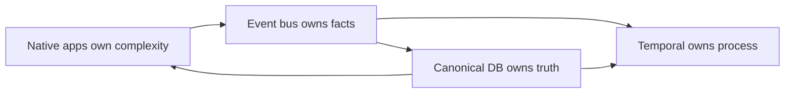
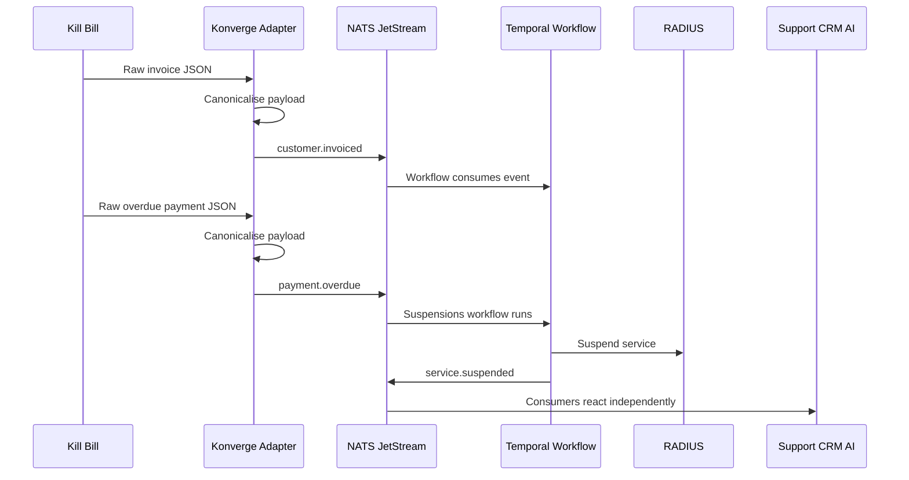

# Konverge Architecture Principle

## EDA now. CDA next.

---

## Purpose

This document explains the founding architecture principle for Konverge:

> **Temporal owns the process.**  
> **The event bus owns the facts.**  
> **Native apps own their complexity.**  
> **The canonical database owns the truth.**

This is the contract every integration, workflow, frontend, Retool implementation, AI capability, and future platform decision must follow.

It gives us a simple way to decide where logic belongs, what must be canonicalised, what may remain local to a domain system, and how the platform remains supportable, replaceable, auditable, observable, and AI-ready.

---

# 1. Plain-English Explanation

Konverge is not trying to replace every system.

Billing can still be billing.  
Field services can still be field services.  
CRM can still be CRM.  
RADIUS can still be RADIUS.  
Retool can still be used where it makes sense.

But every system must participate in one shared operating model:

```text
External systems own their internal details.
Konverge owns the customer journey.
```

So the question is not:

> Can this system do the work?

The question is:

> When this system does the work, how does Konverge know what happened, what it means, and what should happen next?

---

# 2. The Foundational Contract



| Component | Owns | Does not own |
|---|---|---|
| **Temporal** | Long-running process, waiting, retries, branching, exceptions, ownership | Every internal step inside every domain system |
| **Event bus / NATS JetStream** | Facts that happened, replay, distribution, audit timeline | Process decisions or business rules |
| **Native apps** | Their internal workflow, domain complexity, local operational records | The wider customer journey or canonical platform meaning |
| **Canonical database** | Authoritative identifiers, agreed reference state, timeline of declarations | Raw operational records for every external system |

This prevents every tool from becoming a God system.

---

# 3. What This Solves

Konverge needs to answer questions like:

- Where is the work?
- Who owns it?
- What state is it in?
- Why is it blocked?
- What system declared this?
- When did it happen?
- What customer, service, order, package or workflow does it relate to?
- What should happen next?
- What should AI, support, billing, provisioning or reporting know?

Konverge answers these questions by making every meaningful business action become a governed canonical event.

---

# 4. EDA Today: Event-Driven Architecture

Today, Konverge uses EDA.

External systems emit raw messages or API payloads. Konverge adapters convert those into canonical events.

## Example: billing event from Kill Bill



## Plain-English version

Kill Bill may own the invoice record. Konverge does not need to copy the full Kill Bill invoice into its own operational database. But Konverge does need to know the business fact:

> Susan Rich was invoiced R999.00 on 21 May 2026, due on 1 June 2026, declared by Kill Bill.

If the payment becomes overdue, Konverge receives another fact:

> Susan Rich has an overdue payment.

That event can trigger a Temporal workflow, which applies the suspension rules and produces a new fact:

> Susan Rich's service was suspended.

Now every system that needs to know can react independently. Support can see it. AI can explain it. CRM can show it. RADIUS has already acted. Reporting can measure it. The event timeline proves it.

---

# 5. The Critical Boundary: Internal Details vs Canonical Facts

Konverge does **not** need to know every internal detail of every system.

Field services can own: engineer scheduling, route planning, internal QA checklist details, job notes, photo uploads, internal dispatch logic.

But Konverge must know the meaningful business outcomes: job scheduled, first attempt failed, QC failed, job completed, install Done-Done, activation blocked.

This is the core distinction.

Examples of canonical outcome events: `job.scheduled`, `job.first_attempt_failed`, `job.qc_failed`, `job.completed`, `work.done_done`, `activation.blocked`.

## Rule

> Native systems keep their internal complexity.  
> Konverge receives the canonical facts needed to continue the customer journey.

---

# 6. Temporal: Process Owner, Not God Workflow

Temporal should not orchestrate every sub-step inside every domain. That would create tight coupling. Instead, Temporal orchestrates the wider customer journey and reacts to canonical outcomes.

Temporal knows: field service was requested, completed, installation passed/failed, provisioning may continue.
Temporal does NOT know: every engineer assignment, every route change, every internal checklist detail.

---

# 7. Native Workflow vs Temporal Branch

Classification test:

> **Does the outcome of this workflow influence canonical process state or trigger another system?**

| Workflow | Where it belongs | Why |
|---|---|---|
| Field engineer scheduling | Native app | Internal field-service complexity |
| QA checklist details | Native app | Local operational detail |
| QC failed | Canonical event | Blocks activation and affects support |
| Provisioning | Temporal branch | Touches network, billing, CRM, support |
| Billing dispute affecting suspension | Temporal branch | Cross-system consequence |
| Internal finance approval note | Native app | Local approval detail |
| Payment failed | Canonical event | Affects customer journey and workflow |

---

# 8. Canonical Truth Is Not One Row

The canonical database does not mean one static row that pretends to know everything. Different systems may hold different valid truths at the same time.

Example: a customer upgrades package.

| Truth type | Owned by | Example |
|---|---|---|
| Contractual truth | Billing | Customer agreed to 100Mbps |
| Operational truth | Network / provisioning | Customer is still active on 50Mbps until provisioning completes |
| Experiential truth | CRM / support | Customer expects the upgrade to be in progress |
| Workflow truth | Temporal | Upgrade is waiting for provisioning completion |

Konverge should not collapse these into one fake current state. It should store authoritative declarations over time.

The canonical layer stores: who declared the fact, when, which customer/service/order, confidence + source metadata, previous and new state, correlation IDs, provenance.

## Definition

> Canonical truth is the latest authoritative declaration of a fact, by the system with domain ownership of that fact, captured with timestamp, confidence, source system, canonical identifiers and provenance.

---

# 9. CDA Next: Context-Driven Architecture

EDA tells us "what happened?" CDA adds "what happened, why, what it relates to, what rules caused it, and what should care."

## Example

Basic EDA event:
```json
{ "event_type": "customer.invoiced", "customer_id": "cus_123", "amount": 999.00, "due_date": "2026-06-01", "source": "killbill" }
```

CDA-enhanced event:
```json
{
  "event_type": "customer.invoiced", "customer_id": "cus_123", "service_id": "svc_456",
  "amount": 999.00, "due_date": "2026-06-01", "source": "killbill",
  "context": {
    "summary": "Susan Rich was invoiced because she has an active 100Mbps Vumatel service configured for upfront billing. Her tenant billing policy requires invoices 10 days before due date.",
    "reason_codes": ["ACTIVE_SERVICE","UPFRONT_BILLING","TENANT_10_DAY_INVOICE_POLICY"],
    "references": [
      "customer:cus_123","service:svc_456","package:pkg_100mb_vumatel",
      "tenant_policy:billing_10_days_before_due","external_invoice:killbill_inv_789"
    ]
  }
}
```

CDA matters because AI can support customer support, workflow automation, Ready-to-Act enrichment, failure-demand classification, root-cause analysis, next-best-action, operational visibility.

---

# 10. Retool's Place in This Architecture

Retool can participate, but cannot bypass the contract.

## Rule

> Retool can assist, initiate, configure or display. But every business-significant transition must still produce a governed canonical signal into Konverge.

If Retool changes billing, field services, product/package, support, training, asset or service-related state, one of these must happen:

1. Retool calls a Konverge command/API.
2. Retool emits a canonical event.
3. The target system emits a canonical event.

No event means no platform memory. No platform memory means broken AI, broken support context, broken reporting, broken flow visibility and weak auditability.

---

# 11. The Non-Negotiable Development Contract

Every integration must define:

| Area | Required answer |
|---|---|
| Domain | Billing, FSM, training, product, support, etc. |
| Native owner | Which system owns internal complexity? |
| Authoritative declarations | Which facts does this system own? |
| Canonical events | What events must it emit? |
| Canonical data | Which fields enter Konverge? |
| Local-only data | Which fields stay inside the native app? |
| Workflow classification | Native workflow or Temporal branch? |
| Failure path | Retry, DLQ, reconciliation, manual fallback |
| Provenance | Source system, timestamp, correlation ID |
| AI context | What context should be available for RAG/CDA? |

---

# 12. Final Wording for the Team

> Konverge should not become a God system.  
> Temporal should not become a God workflow.  
> Retool should not become a shadow platform.  
> Native systems should not become silent islands.  
>
> Every system can own its domain.  
> Every meaningful business transition must emit a governed canonical signal.  
>
> That is how we preserve source-of-truth, audit, AI context, operational visibility, replaceability and customer-journey integrity.
